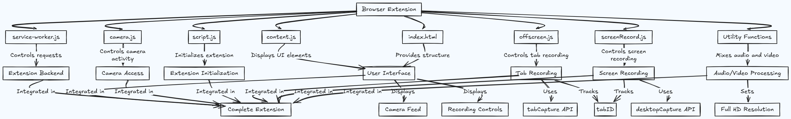

# Screen & Tab Recorder Extension

## Overview
This Chrome browser extension enables users to record browser tabs or the entire screen in **Full HD resolution**, with optional camera overlay. It integrates with the **tabCapture API** and **desktopCapture API** to facilitate high-quality recordings while ensuring an intuitive user experience.

## Features
- **Tab Recording**: Captures the active tab with audio.
- **Screen Recording**: Records the entire screen, application window, or a specific tab.
- **Camera Overlay**: Enables or disables a webcam feed during recording, also change camera position by dragging the container.
- **Dark Mode Support**: Adapts UI based on system preferences.
- **Storage Management**: Saves recording states and user preferences.
- **Background Processing**: Uses a background script to manage recording lifecycle.
- **Optimized Performance**: Efficiently handles media streams to ensure smooth recording.

---
## System Architecture
The extension is structured into modular components to ensure maintainability and scalability.

### **Architecture Diagram**

### **Key Components**
#### 1. **Extension Backend**
- service-worker.js: Manages event-based background tasks, including message handling, media permissions, and storage updates.

#### 2. **User Interface**
- index.html: Provides the main UI structure for users to start/stop recordings.
- content.js: Injects UI elements and controls within the active tab.

#### 3. **Camera Access**
- camera.js: Manages webcam overlay and integrates it with the recording system.

#### 4. **Extension Initialization**
- script.js: Handles extension startup logic, user interactions, and permissions.

#### 5. **Recording Modules**
- **Tab Recording**
  - offscreen.js: Controls background tab recording via tabCapture API.
- **Screen Recording**
  - screenRecord.js: Manages full-screen recording using desktopCapture API.

#### 6. **Audio/Video Processing**
- utility-functions.js: Handles media processing, including mixing audio and video to ensure Full HD resolution.

---
## **Flowchart: Recording Process**

mermaid
flowchart TD;
    A[User Starts Recording] --> B{Select Recording Mode}
    B -->|Tab Recording| C[Inject Content Script]
    B -->|Screen Recording| D[Create Screen Capture Tab]
    C --> E[Capture Tab Audio & Video]
    D --> F[Capture Screen Stream]
    E & F --> G[Process & Encode Media]
    G --> H[Save Recording Locally]
    H --> I[User Stops Recording]
    I --> J[Cleanup Resources]

---
## Installation Guide
### **Step 1: Clone Repository**
sh
git clone https://github.com/accoladesio/casta.git
cd screen-tab-recorder

### **Step 2: Load the Extension**
1. Open **Google Chrome** and go to chrome://extensions/.
2. Enable **Developer Mode** (toggle in the top right corner).
3. Click **Load Unpacked** and select the project folder.
4. The extension is now ready to use!

---
## Usage Guide
1. Click the **extension icon** in the Chrome toolbar.
2. Choose **"Record Tab"** or **"Record Screen"**.
3. (Optional) Enable or disable **camera overlay**.
4. Click **Stop Recording** when done.
5. Your recording will be processed and available for playback.

---
## **Permissions Explained**
- tabs: Access and record the active tab.
- activeTab: Execute scripts within the active page.
- storage: Save user settings and recording states.
- scripting: Inject scripts into web pages.
- offscreen: Record tabs in the background.

---
## **Troubleshooting & FAQs**
#### **Why isn't the recording starting?**
- Ensure you have granted the necessary permissions.
- Refresh the tab before recording.

#### **Why do I need to refresh after stopping the recording for the camera to turn off?**
- Some browser restrictions prevent immediate removal of camera elements. A background script fix is in progress.

#### **Where are my recordings saved?**
- Currently, they are stored locally. Future updates may include cloud storage support.

---
## Future Improvements
- Add recording quality settings (e.g., 720p, 4K support).
- Implement cloud storage integration for direct uploads.
- Enhance UI for better user experience.
- Improve background resource cleanup.

---

---
## Contributors
- **Name** (@accoladesio)
- Open to contributions! Feel free to submit PRs.

---
